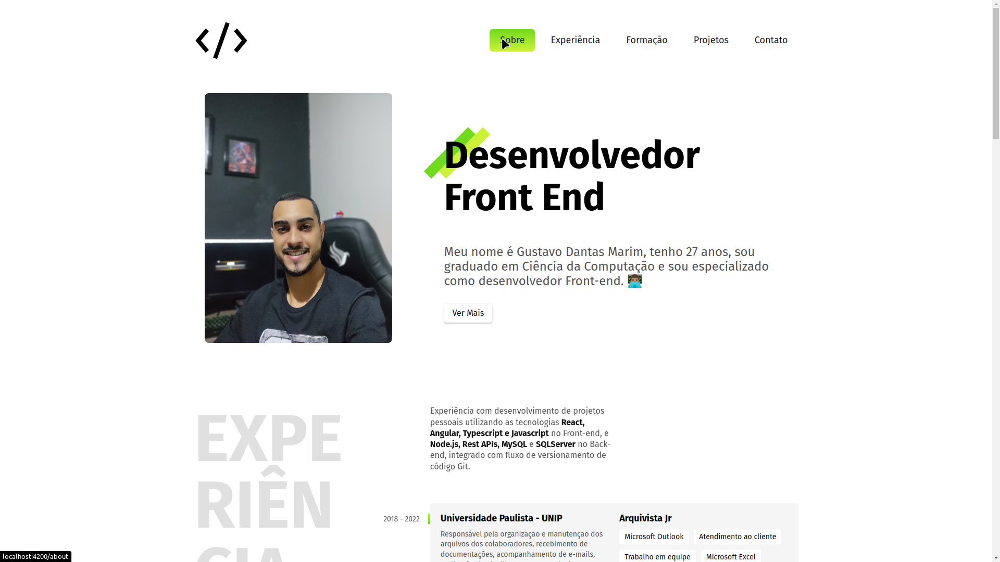
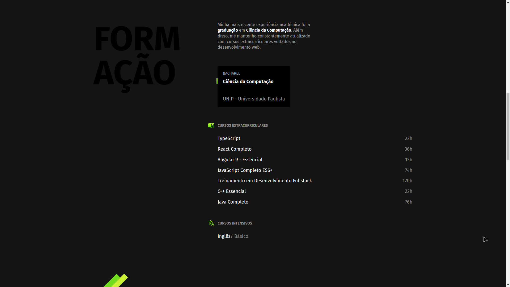
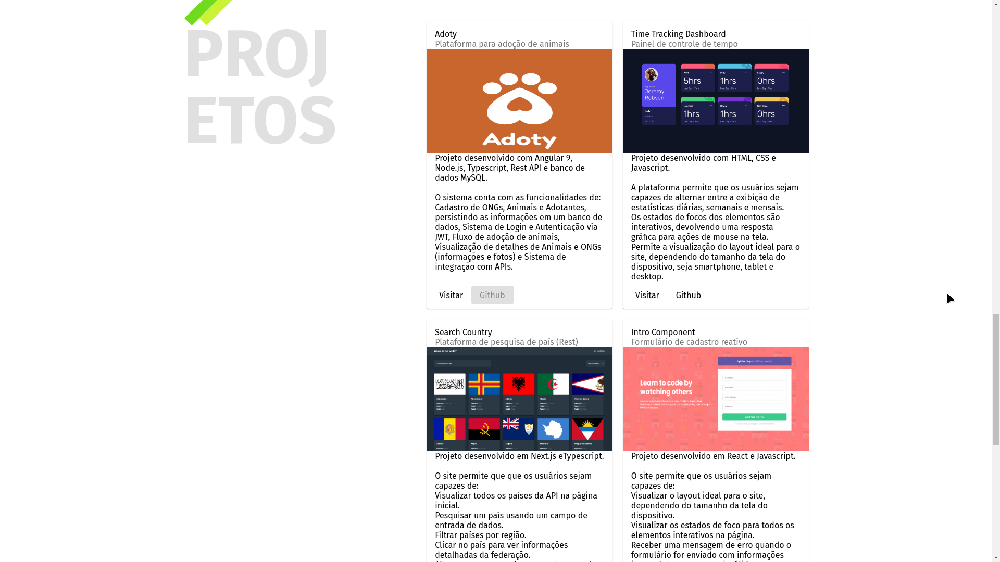
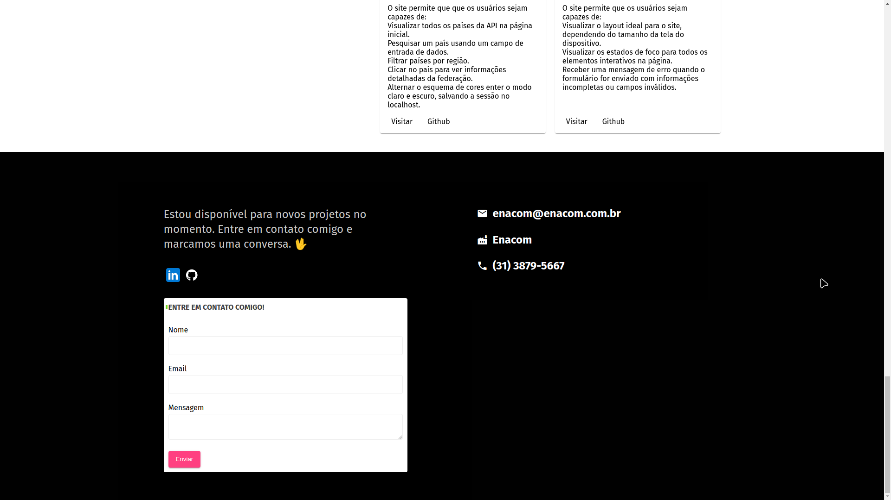

# PORTFÓLIO

Esta é a solução para o desafio Front-end ENACOM

## Tabela de conteúdos

- [Visão Geral](#visão-geral)
  - [O Desafio](#o-desafio)
    - [Funcionalidades](#funcionalidades)
  - [Captura de Tela](#captura-de-tela)
  - [Links](#links)
- [O meu processo](#o-meu-processo)
  - [Construído com](#construído-com)
- [Execução do Projeto](#execução-do-projeto)
- [Autor](#autor)

## Visão geral

### O desafio

Desenvolver um portfólio utilizando material design e framework Angular na versão 13.
O portfólio deve apresentar suas experiências profissionais, cursos, tempo nas
linguagens de programação e projetos já desenvolvidos (caso tenha).

### Funcionalidades

- [x] Criação de componentes e utilização de evento (input, output);
- [x] Emissão de eventos;
- [x] Utilização do ciclo de vida (ngOnInit, ngDestroy, ngOnChanges);
- [x] Aplicar diretivas angular (ngClass, ngSytle, ngIf, ngFor);
- [x] Utilizar Forms Reactive;
- [x] Configurar arquivo de Routing;
- [x] Responsividade;
- [x] Disponibilizar código no github, utilizando padrões gitflow.
- [x] Apresentar um campo para entrar em contato no rodapé, integrado com a api: Link API.

<br>

### Captura de Tela






<br>

### Links

- URL da solução: [Github](https://github.com/gustavomarim/portfolio-gustavo-angular)
- Deploy: [-](-)

<br>

## O meu processo

#### Construído com:

- [Angular 13+](https://angular.io/)
- [Typescript](https://www.typescriptlang.org/)
- [Angular Material](https://material.angular.io/)
- [Material Icons Font](https://developers.google.com/fonts/docs/material_icons?hl=pt-br)
- [CSS3](https://developer.mozilla.org/pt-BR/docs/Web/CSS)
- [Gitflow](https://www.atlassian.com/br/git/tutorials/comparing-workflows/gitflow-workflow)


## Execução do Projeto

### Pré-requisitos

Antes de começar, você vai precisar ter instalado em sua máquina as seguintes ferramentas:
[Git](https://git-scm.com), [Node.js](https://nodejs.org/en/). 
Além disto é bom ter um editor para trabalhar com o código como [VSCode](https://code.visualstudio.com/)

### 🎲 Rodando em localhost

```bash
# Clone este repositório
$ git clone https://github.com/gustavomarim/portfolio-gustavo-angular

# Acesse a pasta do projeto no terminal/cmd
$ cd portfolio-gustavo-angular

# Instale as dependências
$ npm install

# Execute a aplicação em modo de desenvolvimento
$ ng serve

# O servidor inciará na porta:4200 - acesse <http://localhost:4200>
```


## Autor

<a href="https://github.com/gustavomarim">
 
 <br />
 <sub><b>Gustavo Dantas</b></sub></a> <a href="https://github.com/gustavomarim" title="GitHub">🚀</a>


Feito com ❤️ por Gustavo Dantas 👋🏽

 [](https://www.linkedin.com/in/gustavodantasmarim/) 
